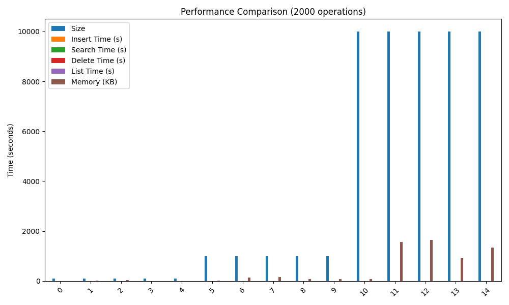
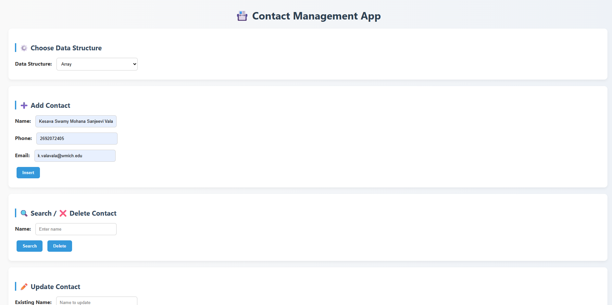
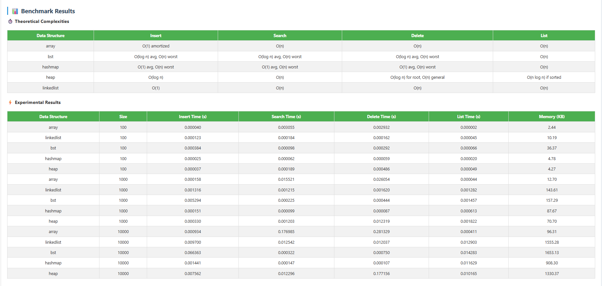

# 📇 Contact Management Application with Data Structure Benchmarking

This project is a **Contact Management System (mini phonebook)** that allows users to store, update, and manage contacts (Name, Phone, Email).  
It supports multiple **data structures** for storage and includes a **benchmarking module** to compare their performance in terms of insertion, search, deletion, listing, and memory usage.

---

## 🚀 Features

- **CRUD Operations**
  - ➕ Insert Contact
  - 🔍 Search Contact
  - ❌ Delete Contact
  - ✏️ Update Contact (NEW)
  - 📋 List All Contacts

- **Choose Data Structure**
  - Array
  - Linked List
  - Binary Search Tree (BST)
  - Hash Map
  - Heap

- **Benchmarking**
  - Measure **Insert/Search/Delete/List** times
  - Track **memory usage**
  - Show **theoretical vs. experimental results**
  - Visualize results in **tables + graphs**

---

## ⚡ How It Works (Flow)

1. User opens the app → `http://127.0.0.1:5000/`
2. Selects a data structure (Array, Linked List, BST, Hash Map, Heap).
3. Performs contact operations (Insert/Search/Delete/Update/List).
4. Runs benchmark:
   - Enters number of operations (e.g., 2000).
   - Backend runs experiments on all data structures.
   - Results are shown as **JSON, HTML tables, and graphs**.

---

## 📊 Benchmark Results

### ✅ Theoretical Complexities

| Data Structure | Insert | Search | Delete | List |
|----------------|--------|--------|--------|------|
| Array          | O(1) amortized | O(n) | O(n) | O(n) |
| Linked List    | O(1) | O(n) | O(n) | O(n) |
| BST            | O(log n) avg, O(n) worst | O(log n) avg, O(n) worst | O(log n) avg, O(n) worst | O(n) |
| Hash Map       | O(1) avg, O(n) worst | O(1) avg, O(n) worst | O(1) avg, O(n) worst | O(n) |
| Heap           | O(log n) | O(n) | O(log n) root, O(n) general | O(n log n) if sorted |

---

### ⚡ Experimental Results

#### Execution Times (Insert/Search/Delete/List)

---

## 🖥️ Frontend UI

- **Main Dashboard**
  
  

- **Benchmark Dashboard**

  

---

## 🔧 Tech Stack

- **Frontend:** HTML, CSS, JavaScript, Chart.js  
- **Backend:** Python, Flask  
- **Benchmarking:** `time`, `tracemalloc`, Matplotlib, Pandas  
- **Data Structures:** Array, Linked List, BST, Hash Map, Heap  

---

## 📌 Future Improvements

- Add **self-balancing trees** (AVL, Red-Black Tree).  
- Persist data with a **database**.  
- Export benchmark results as **Excel/PDF reports**.  

---

## 👨‍💻 Author

- **Valavala Kesava Swamy Mohana Sanjeevi**

